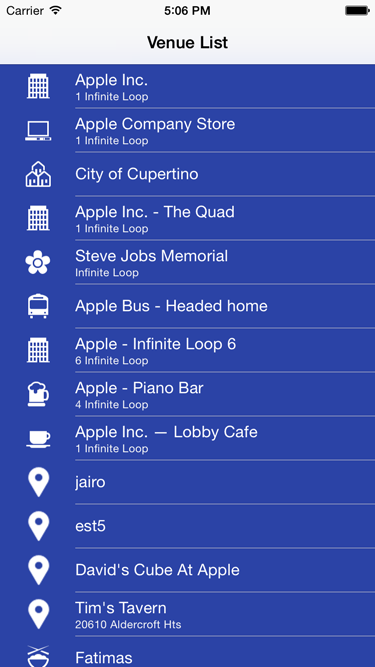

# FoursquareAPIClient

[](https://www.bitrise.io/app/b220011d79899255)

[](https://github.com/koogawa/FoursquareAPIClient)

`FoursquareAPIClient` is very simple Swift networking library for Foursquare API v2.



## Installation

### CocoaPods

First, add the following line to your [Podfile](http://guides.cocoapods.org/using/using-cocoapods.html):

```ruby
pod 'FoursquareAPIClient'
```

Second, install `FoursquareAPIClient` into your project:

```ruby
pod install
```

### Carthage

- Add it to your Cartfile:
```
github "koogawa/FoursquareAPIClient"
```
- Run `carthage update --platform iOS`
- Add 'FoursquareAPIClient.framework' to 'Linked Frameworks and Library' on your project.
- Add `/usr/local/bin/carthage copy-frameworks` to 'New Run Script Phase'.
- Add `$(SRCROOT)/Carthage/Build/iOS/FoursquareAPIClient.framework` to 'Input Files'.

### Manually

Copy all the files from the FoursquareAPIClient folder to your project.

* FoursquareAPIClient.swift
* FoursquareAuthClient.swift (Optional)
* FoursquareAuthViewController.swift (Optional)

## Usage

### Import

```swift
import FoursquareAPIClient
```

### Setup session

```swift
let client = FoursquareAPIClient(accessToken: "YOUR_ACCESS_TOKEN")
```

or

```swift
let client = FoursquareAPIClient(clientId: "YOUR_CLIENT_ID", clientSecret: "YOUR_CLIENT_SECRET")
```

#### Versioning

```swift
// Set v=YYYYMMDD param
let client = FoursquareAPIClient(accessToken: "YOUR_ACCESS_TOKEN", version: "20140723")
```

or

```swift
let client = FoursquareAPIClient(clientId: "YOUR_CLIENT_ID", clientSecret: "YOUR_CLIENT_SECRET”,
                                  version: "20140723”)
```

### Search Venues

```swift
let parameter: [String: String] = [
    "ll": "35.702069,139.7753269",
    "limit": "10",
];

client.request(path: "venues/search", parameter: parameter) { result in
    switch result {
    case let .success(data):
        // parse the JSON data with NSJSONSerialization or Lib like SwiftyJson
        // e.g. {"meta":{"code":200},"notifications":[{"...
        let json = try! JSONSerialization.jsonObject(with: data, options: [])

    case let .failure(error):
        // Error handling
        switch error {
        case let .connectionError(connectionError):
            print(connectionError)
        case let .responseParseError(responseParseError):
            print(responseParseError)   // e.g. JSON text did not start with array or object and option to allow fragments not set.
        case let .apiError(apiError):
            print(apiError.errorType)   // e.g. endpoint_error
            print(apiError.errorDetail) // e.g. The requested path does not exist.
        }
    }
}
```

### Check in to Venue

```swift
let parameter: [String: String] = [
    "venueId": "55b731a9498eecdfb"3854a9”,
    "ll": "37.33262674912818,-122.030451055438",
    "alt": "10”,
];

client.request(path: "checkins/add", method: .post, parameter: parameter) { result in
    switch result {
    case let .success(data):
        // parse the JSON data with NSJSONSerialization or Lib like SwiftyJson
        // e.g. {"meta":{"code":200},"notifications":[{"...
        let json = try! JSONSerialization.jsonObject(with: data, options: [])
    case let .failure(error):
        // Error handling
        switch error {
        case let .connectionError(connectionError):
            print(connectionError)
        case let .responseParseError(responseParseError):
            print(responseParseError)   // e.g. JSON text did not start with array or object and option to allow fragments not set.
        case let .apiError(apiError):
            print(apiError.errorType)   // e.g. endpoint_error
            print(apiError.errorDetail) // e.g. The requested path does not exist.
        }
    }
}
```

### Add a Photo

```swift
let parameter: [String: String] = [
    "checkinId": "IHR8THISVNU",
    "broadcast": "twitter,facebook",
    "postText": "Awesome!",
];

let yourImage = UIImage(named: "photo")
let imageData = UIImageJPEGRepresentation(yourImage!, 1)

client.upload(path: "photos/add", parameter: parameter, imageData: imageData!) {
    result in
    switch result {
    case let .success(data):
        // Upload success
    case let .failure(error):
        // Upload error
    }
}
```

## Authorization

### Setup

```swift
let client = FoursquareAuthClient(clientId: "YOUR_CLIENT_ID",
                                  callback: "YOUR_CALLBACK_URL",
                                  delegate: self)
```

### Delegate

```swift
func foursquareAuthClientDidSucceed(accessToken: String) {
    print(accessToken)
}

func foursquareAuthClientDidFail(error: NSError) {
    print(error.description)
}
```


## Requirements

Swift 5.0 / iOS 8.0+

## Creator

[Kosuke Ogawa](http://www.twitter.com/koogawa)

## License

The MIT License. See License.txt for details.

